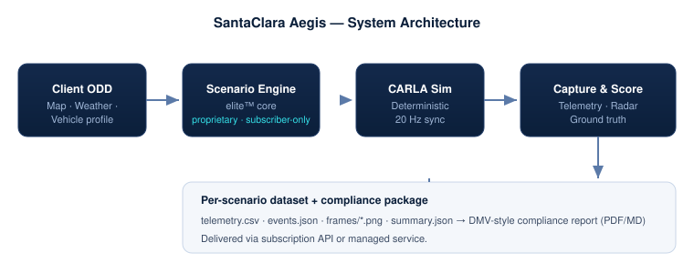

# Architecture

SantaClara Aegis turns a client's Operating Design Domain (ODD) into
**reproducible, labeled safety-simulation evidence**. The pipeline is split
into an open reference layer and a proprietary core.



## Stages

1. **Client ODD** — map (stock or client-specific OpenDRIVE), weather, and
   vehicle profile define the simulation context.
2. **Scenario Engine (`elite/`, proprietary)** — the deterministic runtime
   that builds and drives each safety event, runs the `SafeDriver` behavior
   model (longitudinal/lateral safety, queue-hold memory), and scores results.
   Delivered to subscribers.
3. **CARLA simulation** — deterministic synchronous mode at 20 Hz with a seeded
   Traffic Manager; every run is reproducible at the scenario-logic level.
4. **Capture & scoring** — per-frame ego kinematics, control commands, radar
   closing-target, and ground-truth perception are recorded; KPIs are scored.

## Outputs

Each scenario produces a self-contained dataset and rolls up into a DMV-style
compliance report:

```
outputs/<run>/
├── <scenario>/
│   ├── telemetry.csv   20 Hz ego kinematics, control, threat gap, TTC
│   ├── events.json     ground-truth trigger timeline + collision log
│   ├── frames/*.png    chase-camera evidence frames
│   └── summary.json    scored KPI summary (verdict, min TTC, min gap, ...)
└── compliance_report.pdf / .md
```

## Why a proprietary core

The `elite/` engine encodes the safety behavior model and the compliance
scoring — the parts that make results defensible to regulators and insurers.
Keeping it subscriber-only protects the IP while the surrounding reference
layer (scenarios, client, sensor rig, maps, samples) is open for review. See
[`elite/README.md`](../elite/README.md).
